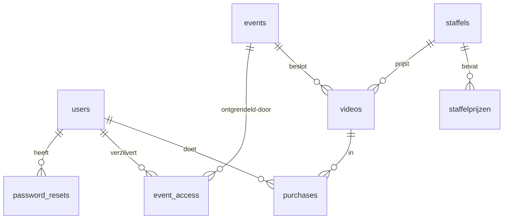
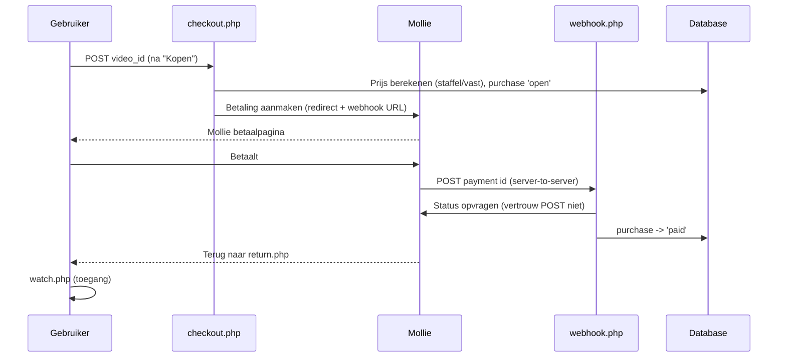

# Architectuur — HB Foto &amp; Video

> Technisch naslagdocument voor de eigenaar/ontwikkelaar.
> Bedoeld om over een paar maanden snel weer in te kunnen duiken of een
> wijziging te kunnen (laten) doen. Geen framework — bewuste keuze voor
> eenvoud bij een kleine catalogus.

Laatst bijgewerkt: mei 2026.

---

## 1. Overzicht

Een zelfgebouwde PHP-applicatie waarmee bezoekers een account aanmaken,
video's kopen via **Mollie**, en deze daarna **gestreamd** kunnen bekijken.
De video's staan **buiten de web root** en zijn alleen via een
toegangscontrole-script bereikbaar.

| Eigenschap | Waarde |
|---|---|
| Taal | PHP 8 (`declare(strict_types=1)` overal) |
| Database | MySQL / MariaDB (PDO) |
| Betalingen | Mollie PHP SDK v2 (via Composer) |
| Hosting | Plesk, Git auto-deploy (`composer install` draait automatisch) |
| Web root | `httpdocs/` |
| Video-opslag | `private/videos/` — **buiten** de web root |
| Frontend | Server-rendered PHP + één `style.css`, geen JS-framework |

---

## 2. Mappenstructuur

```
httpdocs/                  ← web root (publiek)
├── index.php              Landingspagina (redirect ingelogde users)
├── login.php              Inloggen (+ rate limiting)
├── register.php           Registreren (+ bot-detectie e-mail)
├── logout.php             Uitloggen
├── forgot_password.php    Wachtwoord vergeten — stap 1 (mail met token)
├── reset_password.php     Wachtwoord vergeten — stap 2 (nieuw wachtwoord)
├── stream.php             Beveiligde videostream (HTTP range requests)
│
├── includes/             ← gedeelde logica (nooit direct opgevraagd)
│   ├── config.php         DB-, Mollie-, site-config (NIET in Git)
│   ├── db.php             PDO singleton: db()
│   ├── auth.php           Login/sessie/rechten helpers
│   ├── csrf.php           CSRF-token generatie + verificatie
│   ├── events.php         Event-toegang (besloten video's)
│   ├── ratelimit.php      Rate limiting (login/reset/event-code)
│   ├── notify.php         Admin-mail bij registratie + bot-score
│   ├── header.php         Gedeelde paginakop + navigatie
│   └── footer.php         Gedeelde paginavoet
│
├── members/              ← alleen voor ingelogde gebruikers
│   ├── index.php          Videocatalogus (gefilterd op event-toegang)
│   ├── watch.php          Videospeler (na aankoop)
│   ├── account.php        Event-code invoeren + overzicht
│   └── help.php           Uitleg voor klanten
│
├── admin/                ← alleen voor admins (requireAdmin)
│   ├── index.php          Video's beheren + verkopen
│   ├── users.php          Gebruikersbeheer (online, aankopen, verwijderen)
│   ├── events.php         Events (besloten toegang) CRUD
│   ├── staffels.php       Staffels (trapsgewijze prijzen) CRUD
│   └── help.php           Handleiding voor admins (Hans)
│
├── payment/             ← Mollie-flow
│   ├── checkout.php       Maakt Mollie-betaling aan, redirect naar Mollie
│   ├── return.php         Gebruiker komt terug van Mollie
│   └── webhook.php        Mollie meldt statuswijziging (server-to-server)
│
├── assets/                style.css, thumbs/
└── vendor/                Composer (Mollie SDK) — auto via deploy

private/videos/            ← videobestanden (buiten web root!)
sql/                       ← installatie- en migratiescripts
```

---

## 3. Database-schema

Volledige install: [`sql/install_full.sql`](../sql/install_full.sql).
Tabellen in FK-volgorde:

| Tabel | Doel | Belangrijke kolommen |
|---|---|---|
| `users` | Accounts | `email`, `password_hash` (bcrypt), `is_admin`, `last_activity` |
| `staffels` | Prijsstaffel (groep) | `naam` |
| `staffelprijzen` | Prijstrappen | `staffel_id`, `aantal_van`, `aantal_tot`, `prijs` |
| `events` | Besloten toegang | `toegangscode` (uniek), `active` |
| `videos` | Catalogus | `price`, `staffel_id?`, `event_id?`, `filename`, `active` |
| `purchases` | Aankopen | `user_id`, `video_id`, `mollie_payment_id`, `status`, `amount` |
| `event_access` | Wie heeft welke code verzilverd | `user_id`, `event_id` |
| `password_resets` | Reset-tokens (SHA-256) | `token`, `expires_at`, `used` |
| `login_attempts` | Rate limiting | `ip`, `action`, `created_at` |

**Relaties (kort):**



---

## 4. Kernstromen

### 4.1 Aankoop &amp; betaling (Mollie)



**Belangrijk:** de betaalstatus wordt **alleen** via de webhook + een
verse API-call bij Mollie bepaald. De `return.php` waar de gebruiker
landt is puur cosmetisch — nooit vertrouwen op queryparameters voor toegang.

### 4.2 Videostreaming

`stream.php?id=X` controleert in volgorde:
1. Ingelogd?
2. Video bestaat en is `active`?
3. Bij event-video: heeft de gebruiker event-toegang?
4. Heeft de gebruiker betaald (`hasPurchased`)?
5. Pas dan: bestand streamen met **HTTP 206 range requests** (seeken werkt).

`basename()` op de filename voorkomt path traversal. Bestanden staan
buiten de web root, dus zijn nooit direct downloadbaar.

### 4.3 Staffelprijzen

Een video kan aan een **staffel** hangen. De prijs hangt af van hoeveel
video's van diezelfde staffel de gebruiker al betaald heeft (bv. 1e €10,
2e–3e €8,75, 4e+ €7,50). Berekening in `members/index.php`
(`berekenStaffelprijs`) en opnieuw server-side in `checkout.php` — de
client bepaalt nooit de prijs.

### 4.4 Events (besloten toegang)

Video's met een `event_id` zijn **onzichtbaar** tot de gebruiker de
toegangscode invoert op `account.php`. Dit is een privacy-model
(niet "zichtbaar maar op slot"). De code wordt verzilverd in
`event_access`. Controle in members-catalogus, checkout, watch en stream.

---

## 5. Beveiliging — stand van zaken

| Aspect | Status | Implementatie |
|---|---|---|
| SQL-injectie | ✅ Gedekt | Overal PDO prepared statements |
| XSS | ✅ Gedekt | `htmlspecialchars(..., ENT_QUOTES)` bij output |
| CSRF | ✅ Gedekt | One-time tokens (`includes/csrf.php`) |
| Path traversal | ✅ Gedekt | `basename()` + opslag buiten web root |
| Wachtwoorden | ✅ bcrypt | `password_hash()` / `password_verify()` |
| Sessie-fixatie | ✅ Gedekt | `session_regenerate_id(true)` bij login |
| Betaal-spoofing | ✅ Gedekt | Webhook vraagt status opnieuw op bij Mollie |
| Brute-force | ✅ Rate limiting | `login_attempts` per IP (`ratelimit.php`) |
| User enumeration | ✅ Gedekt | Login/reset geven altijd dezelfde melding |
| Bot-registratie | ⚠️ Detectie | Score + admin-mail (`notify.php`), geen blokkade |
| E-mailverificatie | ❌ Niet aanwezig | Bewuste keuze; zie aandachtspunten |

### Rate-limietinstellingen (`includes/ratelimit.php`)
| Actie | Limiet |
|---|---|
| `login` | 5 / 10 min per IP |
| `forgot_password` | 3 / 10 min per IP |
| `event_code` | 10 / 10 min per IP |

We vertrouwen **alleen `REMOTE_ADDR`**, niet `X-Forwarded-For` (spoofbaar).

---

## 6. Configuratie &amp; deployment

- **`includes/config.php`** staat in `.gitignore`. De serverversie bevat de
  echte Mollie-sleutel en DB-credentials en wordt handmatig via Plesk
  onderhouden. Bij een nieuwe omgeving: kopieer en vul `BASE_URL`,
  `VIDEO_PATH`, DB- en Mollie-gegevens in.
- **Deploy** gaat via Git (Plesk pull + automatische `composer install`).
- **Database-migraties** los uitvoeren via phpMyAdmin. Losse
  `migration_*.sql` bestanden in `sql/` zijn incrementeel;
  `install_full.sql` is de volledige verse installatie.
- Zie [`DEPLOY.md`](../DEPLOY.md) voor de stap-voor-stap deploy.

### Sessie-instellingen (config.php)
`cookie_httponly`, `cookie_secure`, `use_strict_mode`, `cookie_samesite=Lax`.
Let op: elke pagina die `session_start()` los aanroept (zoals `index.php`)
moet dezelfde `ini_set`-regels zetten, anders ontstaat een sessie-mismatch
en een valse "sessie verlopen" melding.

---

## 7. Openstaande aandachtspunten / ideeën

Geen acute problemen, wel overwegingen voor later:

1. **E-mailverificatie** — nu niet aanwezig. Kan zonder webhook: token +
   `verify_email.php` (zelfde patroon als wachtwoord-reset). Vereist een
   `email_verified` kolom en een keuze: blokkeer login, blokkeer kopen, of
   alleen een banner.
2. **Event-codes verlengen** — nu `random_bytes(4)` = 8 hex-tekens. Voor
   grote events overwegen naar `random_bytes(8)` = 16 tekens.
3. **`password_resets` / `login_attempts` opschonen** — verlopen rijen
   worden per request opgeruimd voor het betrokken IP/gebruiker, maar er is
   geen globale schoonmaak. Niet gevaarlijk, wel huishouding (eventueel
   cron).
4. **E-mailbezorging** — verloopt via PHP `mail()` (lokale Postfix). Zonder
   correct **SPF/DKIM** in DNS belanden mails mogelijk in spam. Bij
   problemen: PHPMailer + SMTP van een echte mailbox.
5. **Mail-afhankelijkheid** — wachtwoord-reset en admin-notificaties gaan
   stil stuk als `mail()` faalt (geen foutmelding aan gebruiker, by design
   tegen enumeration). Houd dit in gaten bij een nieuwe omgeving.

---

## 8. Handige instappunten bij wijzigingen

| Wil je... | Kijk in |
|---|---|
| Prijslogica aanpassen | `members/index.php`, `payment/checkout.php` |
| Toegang tot een video wijzigen | `stream.php`, `members/watch.php` |
| Navigatie/menu aanpassen | `includes/header.php` |
| Velden bij registratie | `register.php`, `includes/notify.php` |
| Beveiligingslimieten | `includes/ratelimit.php` |
| Nieuwe admin-functie | `admin/` + link in `header.php` + `admin/*` nav |
